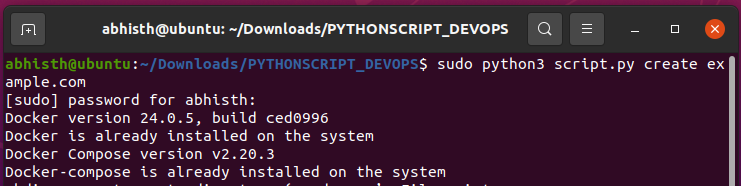
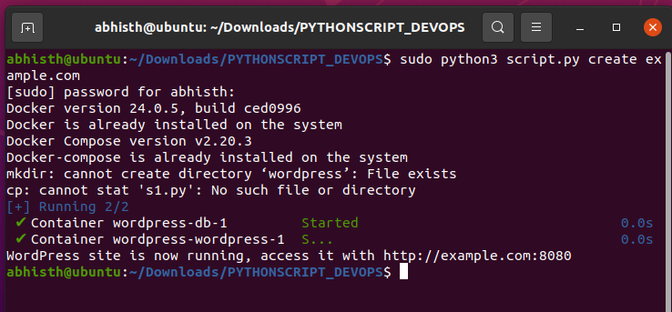
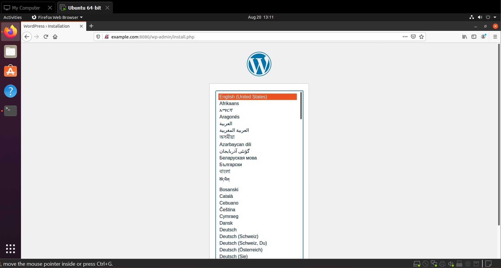
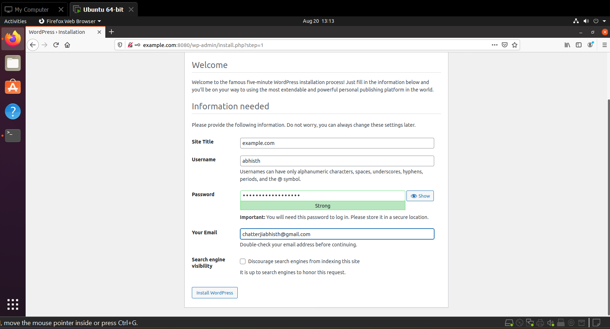
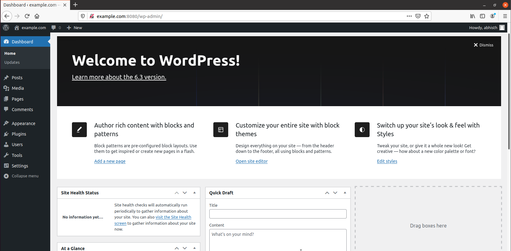
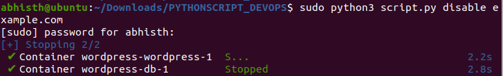
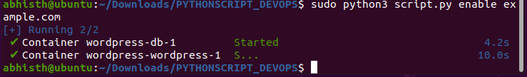
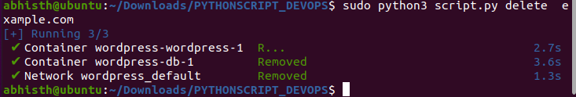

# rtCamp DevOps Engineer Assignment

## Description
Welcome to the Dockerized WordPress LEMP Stack Script using Python.
This script aims to simplify the process of setting up and managing WordPress sites using a LEMP stack within Docker containers.  With the support of Python as scripting language and a range of features including dependency management, site creation, enabling/disabling, and deletion.

## Outlines of Assignment
- Task 1: Check if docker and docker-compose are installed on the system. If not present, install the missing packages.
- Task 2: The script should be able to create a WordPress site using the latest WordPress Version. Please provide a way for the user to give the site name as a command-line argument.
- Task 3: It must be a LEMP stack running inside containers (Docker) and a docker-compose file is a must.
- Task 4: Create a /etc/hosts entry for example.com pointing to localhost. Here we are assuming the user has provided example.com as the site name.
- Task 5: Prompt the user to open example.com in a browser if all goes well and the site is up and healthy.
- Task 6: Add another subcommand to enable/disable the site (stopping/starting the containers)
- Task 7: Add one more subcommand to delete the site (deleting containers and local files).

## Explanation in detail with screenshots

### Development Details
- Language Used: Python
- Code Editor Used: VsCode
- Development Platform: Windows 11
- Testing Platform: Ubuntu 20.04.2 LTS

### How to run the script
1. Start by clicking the "Fork" button at the top right corner of the repository page to create your own copy of the repository on your GitHub account.
2. Open the terminal and use the following command to clone the repository. This will automatically create a folder named "PYTHONSCRIPT_DEVOPS" or use your preferred folder name.
`git clone https://github.com/Ac-11/PythonScript_devops.git`
3. Go to the directory and run the script
`cd PYTHONSCRIPT_DEVOPS`

#### Task 1: Check if docker and docker-compose are installed on the system. If not present, install the missing packages.

```bash
#Run the python script to execute
sudo python3 script.py create example.com
```


#### Task 2: The script should be able to create a WordPress site using the latest WordPress Version. Please provide a way for the user to provide the site name as a command-line argument.

```bash
#to create WordPress site
sudo python3 script.py create "SiteNameyouWant"

#to create a wordpress site named example.com
sudo python3 script.py create example.com
```


#### Task 3:  It must be a LEMP stack running inside containers (Docker) and a docker-compose file is a must.

```bash
#Docker compose file specifications
version: '3'
services:
  db:
    image: mysql:5.7
    restart: always
    environment:
      MYSQL_RANDOM_ROOT_PASSWORD: 1
      MYSQL_DATABASE: wordpress
      MYSQL_USER: wordpress
      MYSQL_PASSWORD: wordpress
    volumes:
      - db_data:/var/lib/mysql
  wordpress:
    depends_on:
      - db
    image: wordpress:latest
    restart: always
    ports:
      - '8080:80'
    environment:
      WORDPRESS_DB_HOST: db:3306
      WORDPRESS_DB_USER: wordpress
      WORDPRESS_DB_PASSWORD: wordpress
      WORDPRESS_DB_NAME: wordpress
    volumes:
      - wordpress:/var/www/html
```
#### Task 4: Create a /etc/hosts entry for example.com pointing to localhost. Here we are assuming the user has provided example.com as the site name.



#### Task 5: Prompt the user to open example.com in a browser if all goes well and the site is up and healthy.





#### Task 6: Add another subcommand to enable/disable the site (stopping/starting the containers)

```bash

#to enable or start wordpress container
sudo python3 script.py enable example.com

#to delete the wordpress container 
sudo python3 script.py delete example.com

```




#### Task 7: Add one more subcommand to delete the site (deleting containers and local files).

```bash

#delete wordpress container
sudo python3 script.py delete example.com

```


## Additional Information

- Why I used Pyhton : 
Using Python for this task offers several benefits. Its clean syntax and readability make the script easy to understand and maintain. Python's cross-platform nature ensures compatibility across various operating systems. Its extensive library ecosystem provides tools for tasks beyond basic scripting, while its dynamic nature facilitates rapid development and prototyping. With an active community and abundant online resources, Python is a reliable choice for utility scripts. Additionally, my familiarity with Python allows me to confidently write and modify the script efficiently.
- Imported Packages:
`os`: This module provides a way to use operating system-dependent functionality like reading or writing to the file system.
`argparse`: This module makes it easy to write user-friendly command-line interfaces. It helps parse command-line arguments and options.
`webbrowser`: This module provides a high-level interface for displaying web-based documents to users.
`subprocess`: This module allows you to spawn new processes, connect to their input/output/error pipes, and obtain their return codes.
- DockerHelper:
This class checks for the presence of Docker and Docker Compose on the system. If they are not present, it installs them.
The is_present method checks for the existence of Docker and Docker Compose executables using the `os.system` command. If not present, it downloads and installs them using shell commands.
- WordPressSiteCreator:
This class is responsible for creating a new WordPress site using Docker containers.The create method performs the following steps:
Creates a directory named `wordpress` to store the necessary files.
Copies a file named `s1.py` to the `wordpress` directory.
Creates a Docker Compose configuration file `docker-compose.yml` for the WordPress site.
Creates an environment file `.env` to provide environment variables to the Docker containers.
Uses subprocess.run to start the Docker containers using the docker-compose up command.
Modifies the system's hosts file to include an entry for the site name.
Prints a message with the site URL and opens the site in a web browser.
- WordPressSiteManager:
This class manages an existing WordPress site created with Docker containers.
The enable method starts the Docker containers for the site using docker-compose start.
The disable method stops the Docker containers for the site using docker-compose stop.
The delete method stops and removes the Docker containers, deletes the `wordpress` directory, and removes the site name from the system's hosts file.
- Main Function (main):
The main function is the entry point of the program.
It uses the argparse module to create a command-line interface with subcommands for different actions: create, enable, disable, and delete.
The user's input is parsed using argparse to determine the desired action and site name.
Depending on the action, the appropriate methods from DockerHelper, WordPressSiteCreator, and WordPressSiteManager classes are called.
If an invalid action is provided, the help message is printed.
In summary, this code is a command-line tool for managing WordPress sites using Docker containers. It provides functionality to create, enable, disable, and delete WordPress sites, handling the installation of Docker and Docker Compose if necessary. The code makes use of various Python packages to interact with the system and manage Docker containers effectively.

## Troubleshooting

If you experience issues while using the script, here are some common problems you might encounter along with their solutions.

1. Docker or Docker Compose Not Installed
Problem: You might encounter an error related to Docker or Docker Compose not being installed on your system.
Solution:

Run the command: docker --version and docker-compose --version to check if Docker and Docker Compose are installed.
If they are not installed, run the command mentioned in the script to install them: python script_name.py install.
2. Permission Errors
Problem: You might encounter permission errors while running the script.

Solution:

Ensure that you are running the script with appropriate permissions, especially if the script requires administrative privileges to perform certain tasks.
If needed, use sudo before the script command to execute it with administrative privileges: sudo python script_name.py.
3. Site Not Accessible in Browser
Problem: After creating a site, you might not be able to access it in the browser.

Solution:

Check if the containers are running using the command: docker ps.
Ensure that you are trying to access the site using the correct URL and port (e.g., http://example.com:8080).
4. Invalid Site Name
Problem: You might encounter issues if you provide an invalid site name.

Solution:

Make sure the site name you provide contains only valid characters (alphabets, numbers, hyphens) and does not contain spaces or special characters.
5. Hosts File Modification
Problem: You might face issues with modifying the hosts file.

Solution:

If modifying the hosts file fails due to permissions, you might need to run the script with administrative privileges using sudo.
6. Uninstalling or Deleting a Site
Problem: You might have trouble uninstalling or deleting a site.

Solution:

Use the appropriate subcommand to delete a site: python script_name.py delete site_name.
If you encounter errors, ensure that you are providing the correct site name and that the site's containers are stopped before attempting deletion.
7. Miscellaneous Errors
Problem: You might encounter other unexpected errors or issues.

Solution:

Check the error message provided by the script to understand the nature of the problem.
If possible, search for the error message online or consult the official documentation of the tools you are using.
8. Getting Help
If you are unable to resolve the issue using the solutions provided above, feel free to open an issue on this repository. Provide detailed information about the problem you are facing, including error messages, steps you took, and the operating system you are using. This will help us assist you better.

## Scope of Improvement

- Use Specific Docker Image Versions: Specify specific versions for WordPress and MySQL images to ensure stability and prevent unexpected behavior due to updates.
- Optimize Docker Images: Remove unnecessary files and dependencies from your Docker images to reduce image size and improve performance.
- Error Handling and User Feedback: Implement error handling to provide clear error messages and instructions to users if something goes wrong during script execution.
- Centralized Configuration: Consider using a configuration file or environment variables to manage settings like image versions, ports, and paths.
- Logging and Debugging: Implement logging mechanisms to keep track of actions performed by the script. This can help troubleshoot issues.
- Automated Testing: Create unit tests to ensure that your script behaves as expected. Tools like pytest can be helpful.

## Future enhancements possible using Cloud Computing and Devops

- Container Orchestration: Explore using Kubernetes or Docker Swarm to manage containers at scale, providing features like load balancing, scaling, and automated updates.

- Infrastructure as Code (IaC): Move towards infrastructure provisioning using tools like Terraform or AWS CloudFormation for cloud-based deployments.

- CI/CD Pipeline: Set up a CI/CD pipeline with a version control repository (like GitHub) and a CI/CD tool (Jenkins, GitLab CI, Travis CI). This enables automated testing and deployment.

- Container Registries: Set up a private container registry (e.g., Docker Hub, AWS ECR, Google Container Registry) to store your Docker images securely.

- Infrastructure Monitoring: Integrate monitoring solutions like Prometheus, Grafana, or cloud-native monitoring services to proactively detect and resolve issues.


